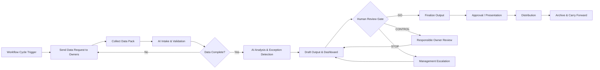
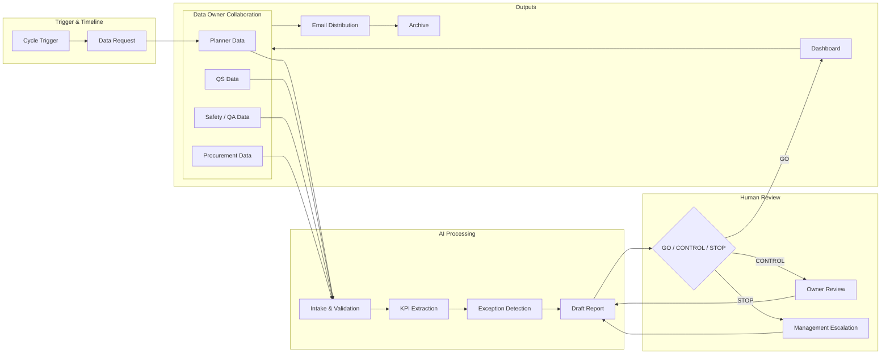

# Pipeline Infographic Builder v0.2

## 1. Overview

Use this skill to turn a rough workflow idea into a clear, teachable, presentation-ready **end-to-end workflow infographic package**.

This skill is designed for AI2C Course 2 and similar enterprise AI transformation training. It is especially useful for construction, engineering, project management, tendering, reporting, RFI, document control, and operational workflows.

The skill does not only create a simple AI process diagram. It helps users design a complete operating workflow covering:

1. Workflow trigger / cycle start
2. Data owner collaboration
3. Input collection
4. AI intake and validation
5. AI analysis, drafting, and exception detection
6. Human review gates
7. Final approval and presentation
8. Email distribution / delivery
9. Archive and carry-forward actions
10. Business value and accountability

For AI workflows, always preserve this governance principle:

```text
AI Drafts -> Human Checks -> Human Signs
```

For end-to-end enterprise workflows, also preserve this operating principle:

```text
Trigger -> Data Owners -> AI Processing -> Human Review -> Final Output -> Distribution -> Archive / Next Cycle
```

---

## 2. Core Teaching Message

Enterprise AI workflow is not only a content-generation pipeline.

It is a **time-based, role-based, and decision-controlled operating workflow**.

The infographic must show not only what AI does, but also:

* When the workflow starts
* Who provides data
* What information is required
* How AI checks and transforms the data
* Where human review is required
* Who approves the output
* How the output is presented or distributed
* What records are archived
* What unresolved issues are carried forward

The user should understand that AI is part of the operating system, not the final owner of the workflow.

---

## 3. When to Use This Skill

Use this skill when the user wants to create any of the following:

* Workflow infographic
* AI agent pipeline diagram
* Construction process visual
* Monthly reporting workflow
* RFI workflow
* Method statement workflow
* Tendering workflow
* Mermaid flowchart
* Pipeline canvas
* Ownership matrix
* Human review gate
* Designer prompt for infographic generation
* Presentation-ready process diagram
* Enterprise AI transformation training material

This skill is especially suitable for the four AI2C Course 2 workflows:

1. Monthly Report Agent
2. RFI Agent
3. Method Statement Agent
4. Tendering Agent

---

## 4. Output Philosophy

Prioritize:

* Logic over decoration
* Ownership over automation hype
* Readability over complexity
* Review gates over AI autonomy
* Business value over technical buzzwords
* Operational rhythm over isolated AI tasks

The final infographic should be understandable within 10 seconds by a non-technical manager.

---

## 4.1 How Users Interact With This Skill

The user does not need to prepare a full specification before using this skill.

The minimum starting input can be one rough sentence:

```text
Use this skill to create a pipeline infographic for [workflow name].
```

Examples:

```text
Use this skill to create a pipeline infographic for an RFI Agent.
```

```text
Use this skill to create a pipeline infographic for our monthly safety observation workflow.
```

```text
Use this skill to turn this rough workflow into a management-ready AI workflow infographic.
```

### 4.1.1 Interaction Modes

Use one of four interaction modes depending on how much information the user provides.

| Mode | When to Use | Agent Behaviour |
|---|---|---|
| Guided discovery | User only has a rough idea | Ask short intake questions, then infer missing parts with labelled assumptions |
| Fast production | User provides enough workflow context | Proceed directly to the full infographic package |
| Benchmark adaptation | User says the workflow is similar to Monthly Report / RFI / Method Statement / Tendering | Reuse the nearest benchmark structure and adapt domain details |
| Revision / QA | User says the output is incomplete, unclear, or unreadable | Identify the failed area, redo the weak section, rerun the checker, and regenerate output |

### 4.1.2 Recommended User Conversation Flow

The preferred interaction is:

1. User names the workflow and business context.
2. Agent asks only the missing high-impact questions.
3. Agent creates the pipeline canvas, ownership matrix, Mermaid flowchart, designer prompt, review gate, and one-sentence summary.
4. User or domain expert reviews workflow logic, missing data, approval responsibility, and risk gates.
5. Agent revises the package.
6. Agent runs the reference-level checker and text visibility QA.
7. Agent outputs the final package only after it passes.

### 4.1.3 What the User Should Review

Ask the user or domain expert to review these items before treating the package as final:

* Is the trigger or cycle start correct?
* Are all data owners included?
* Are the input sources realistic?
* Are AI tasks specific and feasible?
* Are GO / CONTROL / STOP gates correct?
* Is final approval assigned to the right human role?
* Is distribution and archive included?
* Is the business value clear?
* Is any domain-critical knowledge missing?
* Is every visible text element readable?

### 4.1.4 Redo Behaviour

If the user identifies missing information, weak domain logic, unclear ownership, weak governance, or unreadable layout, do not defend the previous output.

Treat the issue as a failed checker result:

```text
REDO REQUIRED
```

Then update the workflow package, regenerate affected outputs, and rerun the checker.

### 4.1.5 Relationship to PRD Work

This skill produces the management and domain discovery layer before a PRD.

It helps management and domain experts define:

* Workflow rhythm
* Data ownership
* AI task boundary
* Human review and approval
* Distribution and archive
* Business value and success metric

After the pipeline is approved, a separate PRD-writing agent or skill can convert the confirmed workflow into technical product requirements for the development team.

---

## 5. Intake Approach

Do not ask for everything at once.

Start with a short intake. Ask follow-up questions only where information is missing. If a reasonable assumption keeps the work moving, make the assumption and label it clearly.

### 5.1 Short Intake Questions

Ask these first:

1. What is the workflow name?
2. Who is the target audience?
3. What is the infographic used for?
4. When does the workflow start?
5. Who provides the input data?
6. What are the main inputs?
7. What are the major process steps?
8. What are the final outputs?

### 5.2 If the User Already Provides Enough Context

If the user has already provided enough information, do not ask again. Proceed directly to structuring the workflow.

### 5.3 If Information Is Missing

Use labelled assumptions.

Example:

```text
Assumption: The monthly reporting cycle starts 7 days before the management meeting, with PM triggering data requests to all data owners.
```

---

## 6. Required Information to Collect or Infer

Before producing the final infographic package, collect or infer the following fields.

### 6.1 Basic Info

* Workflow name
* Title
* Subtitle
* Target audience
* Use case
* Output format
* Language
* Presentation context

### 6.2 Trigger / Cycle

* Is the workflow monthly, weekly, daily, or event-triggered?
* What starts the workflow?
* Who triggers it?
* Is there a deadline?
* Is there a cut-off date?
* Is there a meeting or approval date?
* Is there a recurring rhythm?

Examples:

* Monthly cycle starts at T-7 days
* RFI starts when a new RFI is received
* Method statement starts when a work package approaches
* Tendering starts when an invitation to tender is received

### 6.3 Data Owners and Roles

Identify all people or teams involved.

For each role, capture:

* Role name
* Responsibility
* Input provided
* Review responsibility
* Approval responsibility
* Output recipient

Common construction roles:

* Project Manager / PM
* Planner
* QS / Commercial team
* Procurement Lead
* Safety Officer
* QA / QC Manager
* Site Engineer
* Project Coordinator
* Design Manager
* Construction Manager
* Bid Manager
* Estimator
* Technical Lead
* Document Controller
* Director / Management
* AI Agent / System

### 6.4 Inputs

For every input, capture:

* Input name
* Description
* Owner / role
* Data type
* Frequency
* Format
* Deadline
* Optional icon idea

Classify inputs as:

* Structured data: Excel, CSV, register, database export
* Semi-structured data: PDF, Word report, form, email, meeting minutes
* Unstructured data: site photo, drawing markup, free text, comments
* Reference knowledge: template, contract clause, method statement library, standard procedure

### 6.5 Processing / AI Tasks

For each processing step, capture:

* Step name
* Purpose
* AI / system role
* Deterministic or AI-generated
* Error handling
* Output of the step

Common AI tasks:

* Intake
* File classification
* Data validation
* Missing data detection
* Extraction
* Normalisation
* KPI calculation
* Retrieval from reference knowledge
* Comparison
* Exception detection
* Risk classification
* Draft generation
* Dashboard preparation
* Action list generation
* Email drafting
* Archive logging

### 6.6 Human Review Gates

For each review gate, capture:

* Gate name
* Trigger condition
* Reviewer
* Check items
* Approval point
* Risk level
* Decision options
* Output after review

Use three levels:

```text
GO = normal / low risk / proceed
CONTROL = medium risk / responsible person review required
STOP = high risk / management or specialist escalation required
```

### 6.7 Final Approval / Presentation

Capture:

* Who finalises the output?
* Who approves it?
* Is there a presentation or meeting?
* Who presents?
* Who receives the final decision pack?
* What must be confirmed before distribution?

### 6.8 Distribution / Delivery

Capture:

* How is the output sent?
* Email, shared drive, dashboard link, PDF, PPT, system notification, WhatsApp, Teams, or other channel?
* Who are the recipients?
* What is the message format?
* Is acknowledgement required?

### 6.9 Archive / Carry Forward

Capture:

* Where is the final record stored?
* What gets archived?
* What unresolved issues are carried forward?
* Who owns follow-up actions?
* Is there an audit trail?
* Is the next cycle automatically prepared?

### 6.10 Governance

Capture:

* Risk level
* AI role
* Human owner
* Review principle
* Sign-off rule
* Stop point
* Audit requirement

Never allow the infographic to imply that AI is the final accountable owner.

### 6.11 Visual Style

Capture:

* Aspect ratio
* Brand constraints
* Colour logic
* Tone
* Icon style
* Layout preference
* Text density
* Language
* Presentation format

---

## 7. Default End-to-End Workflow Structure

Unless the user specifies another structure, organize the infographic into eight main blocks:

1. **Workflow Trigger / Cycle Start**
2. **Data Owner Input Collection**
3. **AI Intake & Validation**
4. **AI Analysis / Exception Detection / Drafting**
5. **Human Review Gate**
6. **Final Approval & Presentation**
7. **Email Distribution / Delivery**
8. **Archive & Carry Forward**

This replaces the older simplified structure:

```text
Inputs -> AI Tasks -> Review Gates -> Outputs
```

The new structure is:

```text
Trigger -> Data Owner Collaboration -> AI Processing -> Human Review -> Approval / Presentation -> Distribution -> Archive / Next Cycle
```

---

## 8. Default Visual Layout

Use this layout unless the user provides another preference.

### 8.1 Top Timeline Bar

Show the workflow rhythm across time.

Examples for Monthly Report Agent:

* T-7 days: PM triggers reporting cycle
* T-5 days: Data request sent to all owners
* T-3 days: Data submission deadline
* T-2 days: AI validation and gap chasing
* T-1 day: Draft report review and management escalation
* Day 1: Monthly report presentation
* Day 1 after presentation: Email distribution and archive

For event-triggered workflows, use:

* Event received
* Initial classification
* Information request
* AI processing
* Review
* Approval
* Issue / submit
* Archive and follow-up

### 8.2 Main Workflow Row

Use 6 to 9 large numbered blocks from left to right.

Recommended blocks:

1. Reporting / workflow cycle trigger
2. Data owner input collection
3. AI intake and validation
4. KPI extraction / AI analysis / exception detection
5. Draft output generation
6. Human review gate
7. Final approval and presentation
8. Email distribution and archive

### 8.3 Ownership & Collaboration Section

Add a matrix under the main workflow row showing who is responsible at each stage.

Roles should be shown clearly.

### 8.4 Key Outputs Section

Show final deliverables as cards.

Examples:

* Dashboard
* Report
* Presentation pack
* Exception log
* Action tracker
* Email distribution record
* Archive record

### 8.5 Business Value Section

Show the business value in a small but visible banner.

Examples:

* Faster reporting
* Better cross-team collaboration
* Early exception visibility
* Clear human accountability
* Better management decision-making
* Stronger audit trail

---

## 9. Output Package

When enough information is available, produce these five required sections.

### 9.1 Infographic Brief

Summarize the workflow purpose, audience, operating logic, and key message in one short paragraph.

The brief must mention:

* Trigger / cycle
* Data owner collaboration
* AI processing
* Human review
* Final output
* Distribution / archive

### 9.2 Pipeline Canvas

Use this expanded canvas:

```markdown
| Canvas Block | Content |
|---|---|
| Workflow Objective |  |
| Trigger / Cycle |  |
| Data Owners |  |
| Input Sources |  |
| AI Tasks / Processing |  |
| Human Review Gates |  |
| Final Approval / Presentation |  |
| Distribution |  |
| Archive & Carry Forward |  |
| Outputs & Owners |  |
| Business Value |  |
```

Keep cell text slide-readable. Group related items instead of listing every micro-step.

### 9.3 Ownership & Collaboration Matrix

Use this table when the workflow involves multiple roles.

```markdown
| Role | Trigger Cycle | Provide Data | AI Support / Monitor | Review Findings | Approve / Sign | Present / Receive Output | Archive / Follow Up |
|---|---|---|---|---|---|---|---|
```

Use short text such as:

* Yes
* No
* Provides programme data
* Reviews if CONTROL / STOP
* Approves final report
* Receives and acknowledges
* Owns follow-up actions

### 9.4 Mermaid Flowchart

Create a clear `flowchart LR` or `flowchart TB` diagram.

The Mermaid flowchart must show:

1. Workflow trigger
2. Data owner input collection
3. AI intake and validation
4. Data completeness decision
5. AI analysis / extraction / exception detection
6. Draft output generation
7. Human review gate
8. GO / CONTROL / STOP paths
9. Final approval / presentation
10. Distribution
11. Archive and carry-forward loop

Use subgraphs if helpful.

Keep labels short. Quote labels that contain punctuation, slashes, parentheses, or special characters.

### 9.5 Designer Prompt

Write a detailed prompt for Figma, image generation, or a human designer.

The designer prompt must include:

* Title
* Subtitle
* Audience
* Purpose
* Aspect ratio
* Layout zones
* Timeline bar
* Main workflow blocks
* Ownership matrix
* Review gate logic
* Output cards
* Business value section
* Colour logic
* Icon direction
* Typography direction
* Governance banner
* Readability constraints
* What to avoid

### 9.6 Human Review Gate

Use this table:

```markdown
| Gate | Trigger | Human Reviewer | Decision | Output |
|---|---|---|---|---|
| GO |  |  |  |  |
| CONTROL |  |  |  |  |
| STOP |  |  |  |  |
```

Also include a short list of non-negotiable human decisions.

### 9.7 One-Sentence Summary

Use this formula:

```text
This workflow uses AI to [AI role], while [human roles] remain responsible for [human responsibility], so the company can [business value].
```

For end-to-end workflows, use this version:

```text
This workflow uses AI to help consolidate, validate, analyse, and draft workflow outputs, while data owners, project leaders, and management remain responsible for input quality, review, approval, distribution, and follow-up, so the company can run a faster, clearer, and more accountable operating cycle.
```

### 9.8 Reference-Level Checker Result

Before delivering the final answer, run the reference-level checker in Section 17 and include a short pass / redo note.

If any mandatory information is missing, or if the final package is less complete than the Monthly Report Agent reference infographic, do not present it as final. Fill the gap by asking a targeted question or making a clearly labelled domain assumption, then regenerate the package.

---

## 10. Mermaid Flowchart Rules

### 10.1 General Rules

* Use `flowchart LR` for left-to-right pipeline visuals.
* Use `flowchart TB` only when the workflow has many review branches.
* Keep the main path readable.
* Avoid more than 16 main nodes unless necessary.
* Use short labels.
* Use decision diamonds for data completeness and review gates.
* Include at least one feedback loop.
* Show AI as a processing layer, not as final owner.
* Show human approval before final output.
* Show distribution and archive after approval.

### 10.2 Recommended Skeleton



### 10.3 Optional Subgraph Structure



---

## 11. Designer Prompt Template

Use this template to generate infographic prompts.

```text
Create a professional end-to-end enterprise workflow infographic titled "[Workflow Name] - End-to-End Operational Workflow".

The infographic should explain how a company completes the workflow from cycle trigger and cross-team collaboration to AI-assisted processing, human review, final approval, presentation or delivery, email distribution, and archive.

Audience: [target audience]

Purpose: [presentation / teaching / management review / student exercise]

Format: 16:9 presentation slide, landscape orientation.

Visual style:
- Enterprise consulting style
- Clean construction management dashboard feeling
- Light background with subtle grid or blueprint texture
- Rounded cards with clear hierarchy
- Professional icons, not cartoonish
- Easy for non-technical managers and students to understand

Layout:
1. Top timeline bar showing the workflow rhythm: [timeline milestones]
2. Main horizontal workflow row with numbered stages:
   - [Stage 1]
   - [Stage 2]
   - [Stage 3]
   - [Stage 4]
   - [Stage 5]
   - [Stage 6]
   - [Stage 7]
   - [Stage 8]
3. Ownership & collaboration matrix below the workflow row showing roles and responsibilities.
4. Key outputs section at the bottom with cards for dashboard, report, action log, distribution record, and archive.
5. Business value banner showing speed, visibility, accountability, and decision support.

Human review gate:
- GO: [low-risk condition]
- CONTROL: [medium-risk condition]
- STOP: [high-risk condition]

Colour logic:
- Blue for trigger, input, and data collection
- Teal or green for AI processing and analysis
- Amber for CONTROL review
- Red for STOP escalation
- Green for approved output
- Grey for missing / unconfirmed data

Icon direction:
- Calendar for workflow trigger
- People icons for data owners
- Excel / document icons for data pack
- AI chip / magnifier for intake and validation
- Chart / warning triangle for analysis and exception detection
- Traffic light for review gate
- Presentation screen for final meeting
- Envelope for email distribution
- Folder / archive box for record keeping

Governance banner:
"AI Drafts -> Human Checks -> Human Signs"
"AI supports analysis and drafting. Humans remain accountable for approval and final decisions."

Readability requirements:
- Must be understandable in 10 seconds
- Text must be readable on a presentation slide
- Use short labels and captions
- Avoid long paragraphs inside boxes
- Avoid too many arrows

Avoid:
- A diagram that only shows AI processing
- Missing timeline
- Missing role ownership
- Missing human review gate
- Missing approval / presentation stage
- Missing email distribution and archive
- Overly futuristic sci-fi style
- Generic chatbot visuals
- Any implication that AI is the final decision-maker
```

---

## 12. Review Checklist

Before finalising, check the output against this checklist.

### 12.1 Workflow Logic

* Is the workflow logically correct?
* Is the trigger or cycle start clear?
* Is the workflow shown from start to finish?
* Are feedback loops shown?
* Are distribution and archive included?

### 12.2 Ownership

* Are all data owners shown?
* Is each role's responsibility clear?
* Is the final owner shown?
* Is AI prevented from appearing as the final owner?

### 12.3 AI Logic

* Are AI tasks specific?
* Does AI intake, validate, extract, compare, detect, draft, or visualise?
* Are deterministic and AI-generated tasks separated where useful?
* Is error handling shown for missing or incomplete data?

### 12.4 Human Review and Governance

* Are GO / CONTROL / STOP gates shown?
* Are risk levels clear?
* Are high-risk items escalated?
* Are non-negotiable human decisions stated?
* Is sign-off required before final output?

### 12.5 Infographic Readiness

* Is the text readable on a slide?
* Are there too many arrows?
* Is the layout clear in 10 seconds?
* Are colours meaningful?
* Are icons helpful rather than decorative?
* Is the business value visible?

---

## 13. Visual Defaults

Use these defaults unless the user provides brand or format constraints.

### 13.1 Format

* 16:9 presentation slide
* Landscape orientation
* Designed for classroom, management, or pitch deck use

### 13.2 Background

* Light background with subtle grid
* Optional faint blueprint or construction document texture
* Avoid heavy dark background unless requested

### 13.3 Tone

* Enterprise consulting style
* Construction technology style
* Clear, structured, and management-friendly

### 13.4 Colour Logic

Use colour as meaning, not decoration:

* Blue: trigger, input, data collection
* Teal / green: AI processing and analysis
* Amber: CONTROL review
* Red: STOP / escalation / high risk
* Green: GO / approved / final output
* Grey: missing data / unconfirmed / archived

### 13.5 Component Style

* Rounded cards
* Section numbers
* Clear arrows
* Timeline dots
* Role icons
* Dashboard cards
* Decision gates
* Bottom governance banner

### 13.6 Icon Ideas

* Calendar
* Bell / trigger
* People / team
* Spreadsheet
* Folder
* Document
* Magnifying glass
* AI chip
* Chart
* Warning triangle
* Traffic light
* Checklist
* Presentation screen
* Signature / approval stamp
* Envelope
* Archive box

### 13.7 Default Governance Banner

```text
AI Drafts -> Human Checks -> Human Signs
Risk Level: CONTROL | AI Role: Validate + Analyse + Draft + Visualise | Humans remain accountable for approval and final decisions
```

---

## 14. Workflow-Specific Guidance

## 14.1 Monthly Report Agent

### Operating Logic

Monthly reporting is a recurring cycle. The infographic must show time, data owners, AI validation, human review, presentation, email distribution, and archive.

### Recommended Timeline

* T-7 days: PM triggers monthly reporting cycle
* T-5 days: Data request sent to all owners
* T-3 days: Data submission deadline
* T-2 days: AI validation and gap chasing
* T-1 day: Draft report review and management escalation
* Day 1: Monthly report presentation
* Day 1 after presentation: Email distribution and archive

### Typical Data Owners

* PM: project highlights, key risks, management concerns
* Planner: programme milestones and delay status
* QS / Commercial: cost, cashflow, variation summary
* Procurement Lead: long-lead items, delivery status, material approval
* Safety / QA: incidents, NCRs, quality issues
* Engineer / Coordinator: RFIs, submissions, site issues
* Director / Management: final approval and escalation decisions

### Typical Inputs

* 8-sheet monthly data pack
* Previous monthly report
* Programme tracker
* Progress tracker
* Cost summary
* Procurement log
* RFI / submission register
* Safety / quality log
* Risk and action log
* Meeting minutes
* Site photos

### Typical AI Tasks

* Collect and classify data
* Validate file completeness
* Detect missing or inconsistent data
* Extract KPIs
* Compare planned vs actual
* Compare previous month vs current month
* Detect exceptions
* Draft report narrative
* Prepare dashboard
* Generate action list
* Draft email distribution message
* Archive report and records

### Human Review Gate

* GO: normal status, PM confirms
* CONTROL: delay, cost variance, procurement issue, RFI backlog, incomplete data
* STOP: safety incident, major overrun, critical delay, contractual risk, client dispute

### Outputs

* Monthly project health dashboard
* Monthly report / presentation pack
* Exception and action log
* Email distribution record
* Archived monthly data pack
* Carry-forward unresolved items

### One-Sentence Summary

```text
This workflow uses AI to consolidate, validate, analyse, and draft monthly project reporting, while PMs, data owners, and management remain responsible for input quality, review, approval, presentation, and follow-up, so the company can run a faster, clearer, and more accountable monthly reporting cycle.
```

---

## 14.2 RFI Agent

### Operating Logic

RFI workflow is event-triggered. It begins when an RFI or site question is received and ends when the response is reviewed, issued, registered, and archived.

### Typical Trigger

* New RFI received
* Site team raises technical question
* Consultant requests clarification
* Drawing conflict discovered

### Typical Data Owners

* Site Engineer: issue description and site evidence
* Design Manager: design interpretation
* QS / Commercial: cost or variation impact
* PM: response coordination and approval
* Consultant / Client: final response recipient
* Document Controller: register update and archive

### Typical AI Tasks

* Classify RFI type
* Extract key question
* Retrieve related drawings, specifications, and previous RFIs
* Identify missing information
* Draft proposed response
* Flag technical, cost, time, or contractual impact
* Update RFI register
* Draft email response

### Human Review Gate

* GO: simple clarification with no cost, time, or design impact
* CONTROL: technical coordination issue or moderate programme / cost impact
* STOP: variation, delay claim, design liability, safety issue, contractual dispute

### Outputs

* Draft RFI response
* Supporting reference list
* Risk / impact tag
* Updated RFI register
* Issued response email
* Archived RFI record

---

## 14.3 Method Statement Agent

### Operating Logic

Method statement workflow is package-triggered. It begins when a work package is approaching and ends when the method statement is reviewed, approved, submitted, and archived.

### Typical Trigger

* Work package approaching
* Site team needs submission
* Client / consultant requires method statement
* New activity or high-risk work planned

### Typical Data Owners

* Construction Manager: work sequence and site method
* Site Engineer: drawings and site constraints
* Safety Officer: risk assessment and safety control
* QA / QC Manager: inspection and test requirements
* PM: final submission approval
* Document Controller: submission and archive

### Typical AI Tasks

* Intake scope, drawings, and site constraints
* Extract relevant standards and requirements
* Draft construction sequence
* Draft method statement sections
* Generate risk-control checklist
* Match inspection hold points
* Prepare submission package
* Draft transmittal email

### Human Review Gate

* GO: standard low-risk method based on approved template
* CONTROL: project-specific constraint, coordination issue, equipment issue, quality hold point
* STOP: high-risk activity, lifting, temporary works, confined space, working at height, safety-critical method

### Outputs

* Draft method statement
* Construction sequence
* Risk-control checklist
* Inspection hold point list
* Submission package
* Approved / archived record

---

## 14.4 Tendering Agent

### Operating Logic

Tendering workflow is opportunity-triggered. It begins when an invitation to tender is received and ends with bid review, submission, email delivery, and archive.

### Typical Trigger

* Invitation to tender received
* Tender addendum received
* Bid / no-bid review requested

### Typical Data Owners

* Bid Manager: tender coordination and submission
* Estimator / QS: pricing and BOQ analysis
* Technical Lead: technical proposal and method
* Commercial Manager: commercial terms and risks
* Director: bid / no-bid and final price approval
* Document Controller: tender record and submission archive

### Typical AI Tasks

* Intake tender document pack
* Classify documents
* Extract requirements
* Build submission checklist
* Identify technical, commercial, and contractual risks
* Generate clarification questions
* Match company credentials and past project evidence
* Draft bid response sections
* Prepare bid review summary
* Draft submission email

### Human Review Gate

* GO: administrative checklist and standard company information
* CONTROL: technical proposal, resource assumptions, compliance issue, programme assumption
* STOP: final price, contractual exception, legal risk, high-risk delivery commitment, bid / no-bid decision

### Outputs

* Tender requirement summary
* Submission checklist
* Clarification list
* Risk register
* Draft bid response
* Bid / no-bid review pack
* Final submission email
* Tender archive record

---

## 15. Student Master Prompt

Students can copy and paste this prompt when using the skill.

```text
I want to design an AI-assisted construction workflow for [Monthly Report Agent / RFI Agent / Method Statement Agent / Tendering Agent].

Please guide me step by step from a rough workflow idea to an end-to-end infographic-ready workflow package.

I need the final output to include:
1. Infographic Brief
2. Pipeline Canvas
3. Ownership & Collaboration Matrix
4. Mermaid Flowchart
5. Designer / Infographic Prompt
6. Human Review Gate
7. One-Sentence Summary

Please make sure the workflow includes:
- Workflow trigger or cycle start
- Timeline or event rhythm
- Data owner collaboration
- Input collection
- AI intake and validation
- AI analysis, drafting, and exception detection
- GO / CONTROL / STOP human review gates
- Final approval or presentation
- Email distribution or delivery
- Archive and carry-forward actions
- Business value

Please ask me structured questions first. If my answer is incomplete, help me make reasonable assumptions and label them clearly.
```

---

## 16. Instructor Use

Use this skill to help students understand that enterprise AI adoption is not about asking one good prompt.

It is about redesigning an operating workflow into a controlled pipeline.

Students should learn to think in five layers:

1. Business rhythm
2. Data ownership
3. AI task chain
4. Human review and accountability
5. Final business output and follow-up

The instructor should keep reinforcing this message:

```text
AI does not replace the workflow owner.
AI transforms data into draft outputs and decision support.
Humans remain responsible for judgement, approval, and accountability.
```

---

## 17. Reference-Level Infographic Checker

Use the four reference diagrams in `assets/reference-benchmarks/` as the minimum maturity benchmark when a workflow infographic needs production-grade output:

1. `01-monthly-report-agent.png`
2. `02-rfi-agent.png`
3. `03-method-statement-agent.png`
4. `04-tendering-agent.png`

The Monthly Report example is the gold-standard operating rhythm benchmark. The RFI, Method Statement, and Tendering examples show how the same reference-level structure adapts to event-triggered, work-package-triggered, and opportunity-triggered construction workflows.

The reference-level standard means the final package must be at least as complete as the Monthly Report Agent example: not a loose flowchart, not only a designer prompt, and not an AI-only process diagram. It must show a full operating workflow with timing, roles, AI tasks, review gates, outputs, distribution, archive, and business value.

### 17.1 Mandatory Benchmark Elements

A final infographic package must include all of these elements:

* Clear title and subtitle naming the workflow and business purpose
* Top timeline or event rhythm showing when the workflow starts and progresses
* 6 to 9 numbered workflow blocks across the main operating row
* Explicit trigger or cycle start
* Data owner input collection with role-specific contributions
* AI intake, validation, missing-data handling, and exception detection
* AI analysis and draft output generation
* GO / CONTROL / STOP human review gate with escalation logic
* Feedback loop for missing data, revision, or escalation
* Final approval, issue, submission, or presentation stage
* Distribution / delivery stage
* Archive, register update, carry-forward, or audit-trail stage
* Ownership and collaboration matrix covering all major roles
* Key outputs section with concrete deliverables
* Business value section
* Governance banner or visible principle: `AI Drafts -> Human Checks -> Human Signs`

### 17.2 Domain-Knowledge Completeness Gate

Do not finalise a workflow if domain-critical construction knowledge is missing.

For RFI workflows, check for:

* RFI trigger, register, due date, drawing / specification references, attachments, consultant / client response path, and document control archive
* Technical, programme, cost, contractual, design liability, and safety impact flags
* Clarification questions, response drafting, reviewer approval, issue log, and superseded / closed status handling

For Method Statement workflows, check for:

* Work package trigger, scope, drawings, site constraints, plant / equipment, sequence, manpower, materials, permits, inspection and test requirements
* Safety risk assessment, high-risk activity escalation, temporary works / lifting / confined space / working at height flags where relevant
* QA / QC hold points, approval, submission, toolbox briefing, and archived approved method

For Tendering workflows, check for:

* Invitation-to-tender trigger, bid / no-bid gate, tender addenda, requirement extraction, submission checklist, pricing / BOQ, programme, technical proposal, commercial terms, and clarification log
* Contractual exception, legal / commercial risk, final price approval, director sign-off, submission delivery, acknowledgement, and tender archive

If a domain item is not available from user input, infer a conservative assumption and label it. Never leave a field blank.

### 17.3 Reference-Level Scoring

Score the package before delivery:

| Dimension | Pass Standard |
|---|---|
| End-to-end workflow completeness | All mandatory blocks present |
| Domain knowledge | No domain-critical gap left blank |
| Ownership clarity | Every major role has input, review, approval, recipient, or archive responsibility |
| AI task realism | AI tasks are specific: intake, validate, extract, compare, detect, draft, log |
| Governance robustness | GO / CONTROL / STOP plus human sign-off are explicit |
| Visual maturity | Timeline, workflow row, matrix, outputs, business value, and feedback loops are all represented |
| Slide readability | Labels are short and presentation-readable |

### 17.4 Text Visibility and Layout QA

Before final delivery, verify that every visible text element can actually be read in the final output. Do not rely only on content completeness.

Check all of the following:

* No text is clipped by a card, table cell, timeline box, output card, business value panel, or canvas boundary.
* No text overflows outside its intended container.
* No text is hidden behind icons, arrows, borders, timeline dots, or decorative shapes.
* Timeline labels do not collide with each other.
* Human review gate text is fully visible, especially GO / CONTROL / STOP descriptions.
* Ownership matrix labels and role rows are visible and not truncated.
* Output cards and business value bullets are fully visible.
* Font sizes remain presentation-readable.
* Decorative arrows or connectors must not cause horizontal or vertical overflow.

If working in HTML, run a browser or DOM-based check for `scrollWidth > clientWidth`, `scrollHeight > clientHeight`, text clipping, and tiny text. If any issue is found, treat the output as failed and redo the layout before delivery.

### 17.5 Redo Rule

If any pass standard fails:

1. Mark the issue as `REDO REQUIRED`.
2. Identify the missing data, weak logic, or weak visual layer.
3. Add the missing information through a labelled assumption or a targeted user question.
4. Regenerate the affected canvas, matrix, Mermaid flowchart, designer prompt, and review gate.
5. Run the checker again.

Do not output a final infographic package until the checker passes.

---

## 18. Quality Bar

A good output from this skill should:

* Show the workflow from beginning to end
* Include timeline or trigger logic
* Show role-based collaboration
* Make AI tasks specific and realistic
* Include data validation and missing data handling
* Include GO / CONTROL / STOP review gates
* Show approval before final output
* Include distribution and archive
* Explain business value clearly
* Be infographic-ready
* Be teachable to students
* Be understandable by management

A weak output usually has these problems:

* It only shows AI processing
* It does not show who provides data
* It does not show when the workflow starts
* It does not show human review
* It does not show final approval
* It does not show email distribution or archive
* It makes AI look like the final decision-maker
* It uses too many technical buzzwords
* It is too complex for a presentation slide

---

## 19. Final Reminder

Every workflow infographic should answer these questions:

1. What starts the workflow?
2. Who provides the data?
3. What does AI do?
4. What does AI not decide?
5. Who reviews and approves?
6. What output is produced?
7. Who receives it?
8. Where is it archived?
9. What happens next?
10. What business value does the company gain?

If the infographic cannot answer these questions, it is not yet ready.
